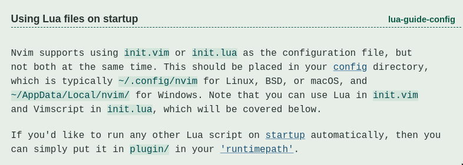
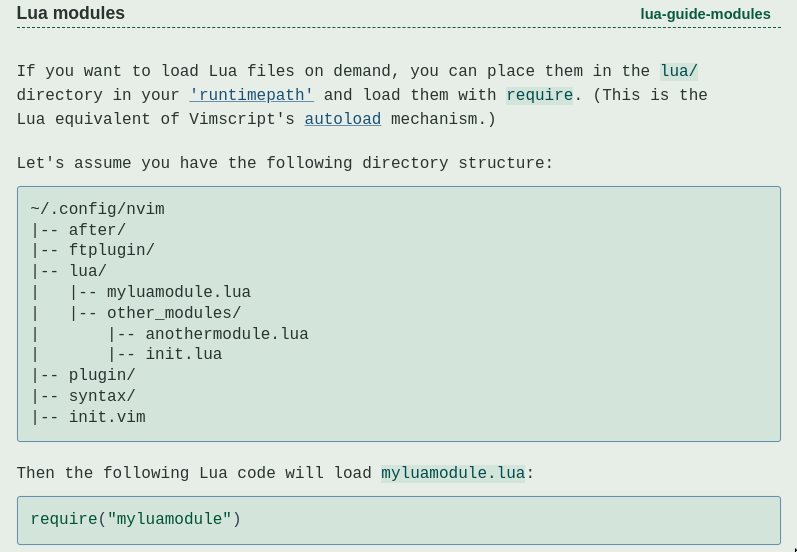

# Planning

## Download do i3WM

- Foi testado em:
  - Ubuntu 22.04

- Gostaria de utilizar gaps na tela do i3 WM, portanto preciso de uma versão acima de i3 4.22
- Segui o tutorial de repositório ubuntu [aqui](https://i3wm.org/docs/repositories.html) que recomenda os seguintes códigos:

```bash
/usr/lib/apt/apt-helper download-file https://debian.sur5r.net/i3/pool/main/s/sur5r-keyring/sur5r-keyring_2024.03.04_all.deb keyring.deb SHA256:f9bb4340b5ce0ded29b7e014ee9ce788006e9bbfe31e96c09b2118ab91fca734

sudo apt install ./keyring.deb

echo "deb http://debian.sur5r.net/i3/ $(grep '^DISTRIB_CODENAME=' /etc/lsb-release | cut -f2 -d=) universe" | sudo tee /etc/apt/sources.list.d/sur5r-i3.list

sudo apt update

sudo apt install i3
```

Porém ao fazer o "sudo apt update" recebi o warning:

```bash
Skipping acquire of configured file 'universe/binary-i386/Packages' as repository 'http://debian.sur5r.net/i3 jammy InRelease' doesn't support architecture 'i386'
```

Para corrigir acessei o arquivo:

```bash
nano /etc/apt/sources.list.d/sur5r-i3.list
```

e adicionamos "[arch=amd64]" para o pacote debian, ao fim teremos:

```bash
deb [arch=amd64] http://debian.sur5r.net/i3/ jammy universe
```

Dessa forma teremos a versão 4.23 ou maior instalada

Para utilizar minha configuração também será necessário instalar:

- maim: utilitário do Ubuntu para tirar screenshots da tela

```bash
sudo apt install maim
```

- xclip: utilitário para enviar imagens, vídeos, textos para o clipboard

```bash
sudo apt install xclip
```

- Para colocar wallpaper usaremos o feh, instalado com

```bash
sudo apt install feh
```

- Para controlar o brilho de backlight do monitor do notebook, usaremos brightnessctl
 
```bash
sudo apt install brightnessctl
```

Esse programa precisa de sudo para rodar, e como o i3 não consegue fazer isso, precisamos dar permissões para rodar "brightnessctl" sem senha para o meu usuário, para fazer isso abra um terminal e rode o comando

```bash
sudo visudo
```

ele irá abrir para você editar as configurações de sudo e privilégios de seu computador, para dar permissões sem senha para o brightnessctl cole as seguintes linhas no fim do arquivo (para descobrir o nome do seu usário escreva whoami em qualquer terminal).

```bash
Cmnd_Alias PASSWORDLESS = /usr/bin/brightnessctl
seu_usuario_aqui ALL = (ALL) ALL
seu_usuario_aqui ALL = (root) NOPASSWD: PASSWORDLESS
```

Finalmente seu i3 deve estar totalmente configurado e você deve ser capaz de diminuir a luminosidade do seu aparelho.

## Picom

Agora para deixar tudo mais bonitinho irei baixar um compositor de janelas chamado picom, com ele será possivel deixar nosso terminal transparente, coisa que eu gosto bastante sendo sincero.

- Para baixar é só rodar

```
sudo apt install picom
```

basicamente para fazer minha configuração copiei o sample conf do repositório do github e fui tirando o que não queria, o picom busca por padrão um arquivo de configuração em $XDG_CONFIG_HOME/picom.conf que no caso é quase sempre em ~/.config/picom.conf

## Terminal

Usaremos o oh my zsh, para isso primeiros precisamos baixar o zsh realizando os seguintes passos:

- Primeiro instalaremos o terminal

```bash
sudo apt install zsh
```

- Depois precisamos defini-lo como o terminal padrão (depois de rodar o comando deslogue e logue no seu usuário)

```bash
chsh -s $(which zsh)
```

Finalmente podemos instalar o Oh My Zshell com o comando retirado do README do projeto

```bash
sh -c "$(curl -fsSL https://raw.githubusercontent.com/ohmyzsh/ohmyzsh/master/tools/install.sh)"
```

### Plugins do Oh My Zsh

#### zsh-autosuggestions

Esse é um dos plugins mais legais, ele faz autocomplete de comandos, para instalar ele é muito simples

```bash
cd $ZSH_CUSTOM/plugins && git clone https://github.com/zsh-users/zsh-autosuggestions ${ZSH_CUSTOM:-~/.oh-my-zsh/custom}/plugins/zsh-autosuggestions
```

Depois precisamos ativar ele dentro do arquivo em ~/.zshrc adicionando:

```bash
plugins=(git ... zsh-autosuggestions)
```

#### zsh-syntax-highlighting

Novamente só precisamos clonar na pasta de plugins

```bash
git clone https://github.com/zsh-users/zsh-syntax-highlighting.git $ZSH_CUSTOM/plugins/zsh-syntax-highlighting
```

e ativar o plugin

```bash
plugins=(git ... zsh-autosuggestions zsh-syntax-highlighting)
```

## Configurações do i3WM

Gosto de colocar:

- Fechar janelas com $mod+q
- Deslogar do i3 com $mod+Shift+q
- Utilizar os atalhos do vim para se mover
- Os atalhos do vim usam atalhos já definidos, para corrigir isso faço o seguinte:
  - Para mudar o split entre horizontal e vertical não podemos usar $mod+h porque já é usado
  - Criei o modo "split" que se inicia apertando $mod+s
  - $mod+s já é usado para entrar no modo stack, mas como não uso esse modo eu simplesmente comentei
- Agora para tirar print screen precisamos baixar
  - maim: "sudo apt install maim" para permitir tirar screenshots do ubuntu
  - xclip "suto apt install xclip" permite enviar imagens e textos para o clipboard

# COnfigurando o VIM com OhMyZsh

## Instalação

Para baixar a versão mais nova do neovim a forma mais fácil é instalando um app_image, por exemplo [Aqui](https://github.com/neovim/neovim/releases/tag/v0.9.5), e adicionando o appImage ao PATH e adicionando aliases de vi e vim


## Configuração

Pela documentação do neovim vemos que precisamos criar um arquivo nvim dentro de ~/.config 



```bash
mkdir ~/.config/neovim
```

Dentro desse arquivo podemos colocar o arquivo init.lua que conterá as configurações iniciais do nosso neovim. 

Porém é melhor dividir nossas configurações em diferentes arquivos, para isso, novamente olhando a documentação percebemos que isso pode ser realizado simplesmente criando uma pasta lua e colocando arquivos .lua la dentro. Dessa forma podemos rodar esses arquivos em nosso init.lua simplesmente escrevendo require("nome_da_pasta.nome_do_arquvio_terminado_em_lua") (podemos usar / no lugar do . também).



Se fizermos require de uma pasta, o lua irá procurar um arquivo chamado init.lua dentro daquela pasta. Então levando em consideração as pastas do exemplo, poderiamos fazer require("other_modules") e o código dentro de init.lua iria rodar.

## Plugins

Primeiro e mais importante precisamos de algum manager de plugins de neovim, para isso usaremos o lazy-nvim

O lazy nvim utiliza uma estrutura de pastas diferentes da padrão do Neovim, por isso, utilizando o lazy-nvim podemos colocar quaisquer configurações de plugins que quisermos dentro da pasta plugins. O Lazy-nvim carrega todos os arquivos dentro de plugins automáticamente, você irá perceber que dentro da pasta lua/plugins nós retornamos a configuração dos plugins, essas configurações são carregadas diretamente no lazy

## Treesitter

Esse é o primeiro plugin que instalo normalmente, ele deixa o texto de códigos formatados mais bonitinho

## markdown-preview

Esse é o plugin que estou usando agora para escrever esse markdown, ele abre um servidor web que recebe as modificações do markdown e renderiza. Além de seguir o seu código

Para usar ele é necessário ter npm instalado. Eu gosto de seguir esse caminho:

- Baixar nvm
- Instalar alguma versão de node com o nvm
- Instale o plugin markdown-preview
- Rode o comando :call mkdp#util#install() (as vezes precisa, as vezes não) para o plugin funcionar direito

Para iniciar o preview é só rodar :MarkdownPreview

